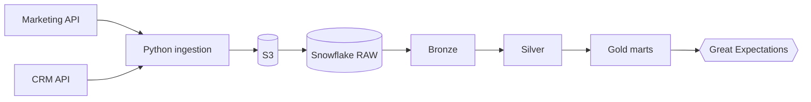

# Marketing Data Pipeline

An ELT pipeline that ingests marketing and CRM data from **REST APIs** into **S3 / Snowflake**, then transforms it with **dbt** through **Bronze / Silver / Gold** layers into campaign-performance and **RFM segmentation** marts. Data quality is enforced by **44 automated checks** (dbt tests + Great Expectations), with lineage documented alongside the code.

**Stack:** Python · dbt · Snowflake · AWS S3 · Great Expectations · DuckDB (local demo)



## Try it in two minutes (no cloud accounts)

The repo ships with a mock REST API and a DuckDB profile, so the full pipeline runs locally with the same dbt SQL used on Snowflake.

```bash
python -m venv .venv && source .venv/bin/activate     # Python 3.10 or 3.11
make install
make demo      # mock API -> raw -> bronze/silver/gold -> 44 checks
```

Then explore the marts:

```bash
python -c "import duckdb; c=duckdb.connect('data/marketing.duckdb'); \
print(c.sql('select segment, count(*) n, round(avg(monetary),2) avg_value from gold.gold_rfm_segmentation group by 1 order by 2 desc'))"
```

## Data model

| Layer | Models | Purpose |
|---|---|---|
| Raw | `campaigns`, `ad_performance`, `customers`, `orders` | Landed API data + `_source_file`, `_loaded_at` |
| Bronze | `brz_*` (views) | Typed raw, nothing dropped |
| Silver | `slv_*` (tables) | Deduplicated (latest load wins), standardised, invalid rows removed |
| Gold | `gold_campaign_performance` | Per campaign: impressions, clicks, spend, CTR, CPC, attributed orders and revenue, ROAS |
| Gold | `gold_rfm_segmentation` | Per customer: recency, frequency, monetary, 1-5 scores, segment |

RFM segments: `CHAMPIONS`, `LOYAL`, `POTENTIAL_LOYALIST`, `AT_RISK`, `HIBERNATING`, `NEEDS_ATTENTION` (rules in [docs/lineage.md](docs/lineage.md)).

## Data quality: 44 automated checks

| Source | Count | What it covers |
|---|---:|---|
| dbt generic tests | 36 | Keys (`unique`, `not_null`), referential integrity, accepted values, numeric ranges, composite uniqueness |
| dbt singular tests | 2 | Gold-to-Silver reconciliation of spend and revenue |
| Great Expectations | 6 | Row counts, null checks and distribution bounds on the Gold marts |
| **Total** | **44** | |

`make count-checks` prints this inventory straight from the project files, and a unit test fails if the documented total drifts.

`dbt build` runs models and dbt tests together, so a failing test blocks downstream models. Great Expectations runs afterwards (`make quality`) and exits non-zero on any failure, which makes it usable as a CI or orchestrator gate.

## Lineage

Version-controlled diagrams (pipeline, model-level and column-level) are in [docs/lineage.md](docs/lineage.md). `make docs` serves the dbt-generated interactive lineage graph with column descriptions and test coverage.

## Production path: S3 + Snowflake

1. Run `sql/snowflake_setup.sql` once (warehouse, schemas, role, S3 storage integration, stage, RAW tables).
2. Copy `.env.example` to `.env` and fill in API, AWS and Snowflake settings. If your API field names differ from the raw columns, add `rename` maps in `ingestion/sources.py`.
3. Run:

```bash
python -m ingestion.run_ingestion --mode cloud     # API -> gzip NDJSON -> S3 -> COPY INTO RAW
export DBT_TARGET=snowflake
cd dbt_project && dbt deps && dbt build
cd .. && python -m quality.run_expectations --backend snowflake
```

`COPY INTO` tracks loaded files, so re-running ingestion does not double-load. Silver also de-duplicates by business key as a second line of defence.

## Project layout

```
.
├── ingestion/            REST client, extractors, S3 + Snowflake + DuckDB loaders, mock API, sample data
├── dbt_project/
│   ├── models/{bronze,silver,gold}/   SQL models + schema.yml tests and docs
│   ├── tests/                         singular reconciliation tests
│   ├── macros/                        schema naming
│   └── profiles.yml                   duckdb (default) and snowflake targets
├── quality/              Great Expectations suites, runner, check inventory
├── sql/snowflake_setup.sql
├── docs/lineage.md
├── tests/                pytest unit tests (client, writer, sample data, check inventory)
├── Makefile
└── .github/workflows/ci.yml
```

## Design notes

- **Portable SQL.** Models use dbt cross-database macros (`dbt.datediff`, `dbt.type_float`) so the same code runs on DuckDB and Snowflake.
- **Deterministic RFM.** `NTILE` ties are broken by `customer_id`, and recency is measured from the latest order in the data rather than `current_date`, so results are reproducible.
- **Realistic dirty data.** The sample generator injects duplicates, mixed casing, null keys and negative amounts, so Silver's cleaning and the tests are exercised on every run.
- **Attribution.** Revenue is attributed to a campaign when a completed order carries its `campaign_id`; orders without one count as organic.

## Troubleshooting

- Dependency conflicts on install: use Python 3.10 or 3.11. Great Expectations 0.18 requires `pandas<2.2` and `numpy<2`.
- `dbt deps` needs internet access to fetch `dbt_utils`.

## License

MIT
