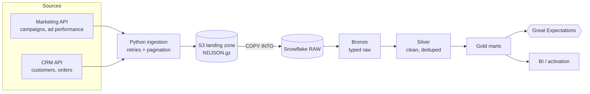
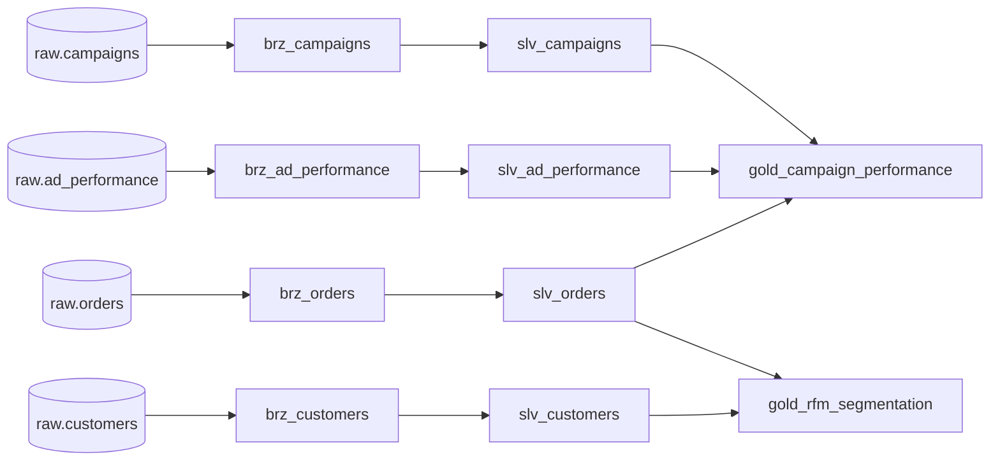

# Data lineage

## Pipeline flow



## Model lineage (dbt)



## Layer contracts

| Layer | Schema | Materialization | Contract |
|---|---|---|---|
| Raw | `raw` | table (loaded by Python) | Exactly what the API returned plus `_source_file`, `_loaded_at` |
| Bronze | `bronze` | view | Typed columns only. Nothing filtered or deduplicated |
| Silver | `silver` | table | One row per business key. Standardised casing/whitespace. Invalid rows dropped |
| Gold | `gold` | table | Business-ready marts with documented grain and KPI definitions |

## Column lineage for key metrics

| Gold column | Derived from |
|---|---|
| `gold_campaign_performance.total_spend` | `slv_ad_performance.spend` (sum per campaign) |
| `gold_campaign_performance.total_revenue` | `slv_orders.order_amount` where `status = 'COMPLETED'` and `campaign_id` is not null |
| `gold_campaign_performance.ctr` | `clicks / impressions` |
| `gold_campaign_performance.roas` | `total_revenue / total_spend` |
| `gold_rfm_segmentation.recency_days` | days from `max(order_date)` per customer to the latest completed order in the data |
| `gold_rfm_segmentation.frequency` | count of distinct completed `order_id` per customer |
| `gold_rfm_segmentation.monetary` | sum of completed `order_amount` per customer |

## RFM segments

| Segment | Rule (scores 1-5, 5 = best) |
|---|---|
| `CHAMPIONS` | R >= 4 and F >= 4 |
| `LOYAL` | R >= 3 and F >= 3 |
| `POTENTIAL_LOYALIST` | R >= 4 and F <= 2 |
| `AT_RISK` | R <= 2 and F >= 3 |
| `HIBERNATING` | R <= 2 and F <= 2 |
| `NEEDS_ATTENTION` | everything else |

Rules are evaluated top to bottom; the first match wins.

## Browsing the generated lineage graph

```bash
make docs        # dbt docs generate + serve; open the lineage graph icon (bottom right)
```

dbt builds the interactive DAG, column descriptions and test coverage directly from the project, so
it stays in sync with the code. The diagrams above are the version-controlled overview.
